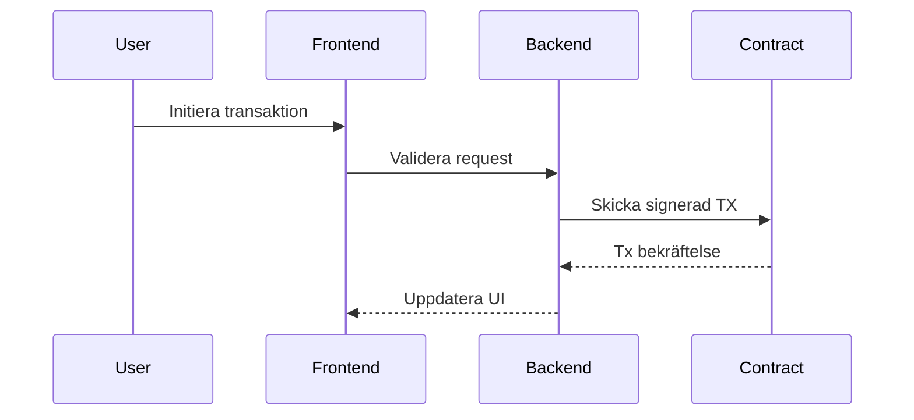

# 🌀 WarpAI - Ultimate Onchain Companion  
**One-stop solution for tracking, earning & socializing on Base Chain**  
*"Your window to web3 reality" - Spawniz*


---

## 🔑 Kärninformation
```yaml
Version: 2.1.0  
Senast uppdaterad: 2025-05-13  
Live URL: https://warplate.vercel.app  
GitHub: https://github.com/gascheckking/warplate  
Kontrakt:  
  - WARP: 0x8ab57bdfc4e900b62f309bfaa6e1802755330ca6  
  - Badges: 0xValidatorContract  
Utvecklare:  
  - Handle: @WarpAI  
  - Wallet: 0xa42b8c353b938e5efd41501e3472bc65e520bb52  
  - Support: warpaiactivity1@gmail.com
```

---

## 🚀 Snabbstart

```bash
git clone https://github.com/gascheckking/warplate.git
cd warplate && npm install
cp .env.example .env.local
npm run dev
```

### Miljövariabler `.env.local`
```ini
OWLRACLE_API_KEY=din_nyckel_här
NEYNAR_API_KEY=din_nyckel_här
ALCHEMY_BASE_URL=https://base-mainnet.g.alchemy.com/v2/
WALLET_CONNECT_PROJECT_ID=din_id_här
```

---

## 🌟 Flaggskeppsfunktioner
| Funktion          | Beskrivning                          | Status     |
|-------------------|--------------------------------------|------------|
| Gas Oracle        | Realtids gaspris med emoji-feedback  | ✅ Live    |
| XP Ecosystem      | Dagliga rewards + streak-bonus       | ✅ Live    |
| Social Feed       | Zora-mints + kreatörsaktivitet       | 🚧 Beta    |
| Copy Mode         | Följ toppwallets automatiskt         | 🛠️ Dev    |
| Warp Badges       | NFT-belöningar för achievements      | 🚀 Kommer  |

---

## 📜 Smart Contracts

### `WarpPoints.sol`
```solidity
function claimDaily() external {
  require(block.timestamp - lastClaim[msg.sender] >= 1 days, "Wait 24h");
  streaks[msg.sender] += 1;
  _mint(msg.sender, 100 ether * streaks[msg.sender]);
  lastClaim[msg.sender] = block.timestamp;
}
```

### `WarpBadges.sol`
```solidity
function mintBadge(address to, string memory ipfsHash) external {
  uint256 tokenId = totalSupply++;
  _safeMint(to, tokenId);
  badgeMetadata[tokenId] = ipfsHash;
}
```

---

## 📊 API Endpoints

```http
GET /api/gas
-> Returnerar gasdata för Base Chain

POST /api/claim
-> Initierar daglig WARP-claim

GET /api/leaderboard
-> Topplista baserad på XP och aktivitet
```

---

## 🗺️ Roadmap 2025

```markdown
Q2 2025:
- [x] Base Chain integration
- [ ] Optimism support
- [ ] Cross-chain swaps

Q3 2025:
- [ ] Social trading
- [ ] DAO governance
```

---

## ⚙️ Systemkrav

```markdown
- Node.js 18+
- npm 9+
- MetaMask eller Rabby
- 2GB RAM eller mer
```

---

## 🌍 Community

- [Discord Server](https://discord.gg/warpai)
- [Warpcast](https://warpcast.com/warpai)
- [GitHub](https://github.com/gascheckking/warplate)

---

## 🛡️ Arkitektur



---

## 📞 Supportflöde

1. Skapa issue på GitHub  
2. DM @WarpAI_Support på Discord  
3. Maila till `warpaiactivity1@gmail.com`  
Svarstid: 1-24h

---

**Licens:** MIT  
**Chain Support:** Base, Zora, Optimism (Q3)  
**Stöd oss:** 0xbc12638e5a84dBd7ef064E307F908343350Eeb60  

```bash
# Donera ETH/WARP
npx hardhat donate --network base --amount 0.1
```

> “By the community, for the community” - WarpAI Manifest
